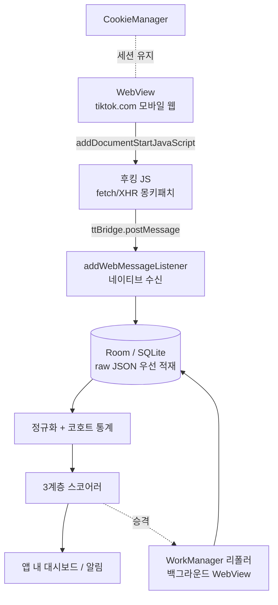

# 안드로이드(삼성 갤럭시)에서 FYP 캡처하기

> [tiktok-fyp-capture-design.md](./tiktok-fyp-capture-design.md)의 안드로이드 구현판.
> 지표 모델(Tier 1/2/3)과 편향 분석은 그대로 유효하고, **캡처 경로만 다시 설계**한다.

---

## 0. 결론 요약

| 경로 | 정확한 카운터 | 루팅 필요 | 갤럭시에서 현실성 | 평가 |
|---|---|---|---|---|
| **WebView 앱 (직접 제작)** | ✅ 원본 정수 | ❌ 불필요 | ✅ 스톡에서 그냥 됨 | ✅ **권장** |
| 안드로이드 브라우저 확장 | ✅ 원본 정수 | ❌ 불필요 | ⚠️ 브라우저 선택지 불안정 | △ 빠른 대안 |
| 접근성 서비스 (네이티브 앱 유지) | ❌ 반올림 표시값 | ❌ 불필요 | ✅ 됨 | △ **Tier 3 전용** |
| 네이티브 앱 트래픽 MITM (비루팅) | ✅ | ❌ but APK 재서명 | ❌ 무결성 검사·계정 위험 | ❌ |
| 네이티브 앱 트래픽 MITM (루팅) | ✅ | ✅ | ❌ **Knox 영구 손상 / 미국 모델 불가** | ❌ |

**한 줄 요약:** TikTok 네이티브 앱은 포기하고, **내가 만든 WebView 앱 안에서 TikTok 모바일 웹을 보는 방식**으로 간다. 데스크톱 확장과 정확히 같은 후킹을 안드로이드 공식 API로 구현할 수 있다.

---

## 1. 네이티브 앱 트래픽은 왜 막다른 길인가

세 겹의 벽이 있고, 갤럭시에서는 네 번째 벽이 추가된다.

**① Android 7+ 사용자 CA 불신뢰**
Android 7(Nougat)부터 앱은 사용자가 설치한 CA 인증서를 신뢰하지 않는다. 앱이 `network security config`로 명시적으로 opt-in해야 하는데, TikTok이 그럴 리 없다. PCAPdroid 같은 로컬 VPN 앱으로 패킷은 잡아도 **TLS를 못 푼다.**

**② 인증서 피닝**
설령 CA 문제를 넘어도 TikTok은 자체 인증서 화이트리스트를 들고 있다. 자체 서명 인증서는 거부된다.

**③ 비루팅 우회 = APK 재서명**
`apk-mitm`으로 network security config를 패치하거나 Frida gadget을 주입해 재패키징하는 방법이 있다. 기술적으로는 루팅 없이 된다. 하지만:
- TikTok은 무결성 검사가 있어 재서명된 APK에서 로그인 실패/기능 차단이 흔하다
- 계정 플래그 위험
- 명백한 ToS 위반

**④ 갤럭시 특유의 문제 — 루팅은 특히 나쁜 거래다**

여기가 삼성 기기의 핵심 차이점이다. 픽셀에서라면 "귀찮지만 되는" 선택지가, 갤럭시에서는 사실상 불가능하거나 대가가 너무 크다.

- **Knox e-fuse는 하드웨어 카운터다.** 부트로더를 처음 언락하는 순간 `0x0 → 0x1`로 **영구히** 트립된다. 다시 락을 걸어도 되돌아오지 않는다.
- 트립 이후 **삼성페이, 시큐어 폴더, 삼성 헬스 일부 기능이 영구 차단**된다.
- **미국/캐나다 스냅드래곤 모델은 OEM unlocking 토글 자체가 없다.** 통신사 모델(Verizon, AT&T 등)은 아예 언락이 불가능하다. 유료 서드파티 서비스 외에는 방법이 없다.
- One UI 8 이후 제약이 더 강화됐다.

> **결론: 갤럭시에서 이 목적으로 루팅하는 것은 권장하지 않는다.** 얻는 것(TikTok 카운터)에 비해 잃는 것(삼성페이·시큐어 폴더·보증·되돌릴 수 없음)이 압도적으로 크다. 아래 §2가 같은 결과를 아무 대가 없이 준다.

---

## 2. ✅ 권장 경로 — WebView 앱

### 2.1 아이디어

데스크톱 확장이 하는 일은 "페이지 스크립트보다 먼저 `fetch`/`XHR`을 후킹해서 응답을 훔쳐보기"다.
안드로이드에는 **이걸 위한 공식 API가 있다.**

| 데스크톱 확장 (MV3) | 안드로이드 WebView |
|---|---|
| `world: "MAIN"` + `run_at: "document_start"` | `WebViewCompat.addDocumentStartJavaScript()` |
| `window.postMessage` → content script | `WebViewCompat.addWebMessageListener()` |
| `chrome.storage` / IndexedDB | Room (SQLite) |

`addDocumentStartJavaScript`는 **페이지의 어떤 자바스크립트보다 먼저 실행이 보장**되고, 원본 화이트리스트를 지정할 수 있으며, iframe에서도 동작한다. 정확히 필요한 물건이다.

그리고 `addWebMessageListener`가 주입하는 브리지 객체는 **document-start 스크립트보다 먼저 주입**되므로, 후킹 스크립트가 그 객체를 바로 쓸 수 있다.

**루팅 불필요, MITM 불필요, APK 재서명 불필요.** 스톡 갤럭시에서 그냥 동작한다.

### 2.2 아키텍처



### 2.3 액티비티 골격

```kotlin
class FeedActivity : AppCompatActivity() {

    private lateinit var web: WebView
    private val origins = setOf("https://www.tiktok.com")

    override fun onCreate(savedInstanceState: Bundle?) {
        super.onCreate(savedInstanceState)

        web = WebView(this).apply {
            settings.javaScriptEnabled = true
            settings.domStorageEnabled = true
            settings.mediaPlaybackRequiresUserGesture = false
            // WebView 기본 UA에는 "wv"가 들어가 일부 경로에서 차별 취급된다
            settings.userAgentString = MOBILE_CHROME_UA
        }
        CookieManager.getInstance().setAcceptThirdPartyCookies(web, true)

        // ① JS → 네이티브 채널. addJavascriptInterface보다 안전하고 원본 제한이 걸린다.
        if (WebViewFeature.isFeatureSupported(WebViewFeature.WEB_MESSAGE_LISTENER)) {
            WebViewCompat.addWebMessageListener(web, "ttBridge", origins) { _, msg, _, _, _ ->
                msg.data?.let { Repo.ingestRaw(it) }   // 파싱하지 말고 원본부터 저장
            }
        }

        // ② 페이지 스크립트보다 먼저 후킹 주입. loadUrl 이전에 호출해야 한다.
        if (WebViewFeature.isFeatureSupported(WebViewFeature.DOCUMENT_START_SCRIPT)) {
            WebViewCompat.addDocumentStartJavaScript(web, HOOK_JS, origins)
        } else {
            // 폴백: onPageStarted + evaluateJavascript — 레이스가 있어 첫 응답을 놓칠 수 있다
            web.webViewClient = LegacyInjectingClient(HOOK_JS)
        }

        setContentView(web)
        web.loadUrl("https://www.tiktok.com/foryou")
    }
}
```

### 2.4 후킹 스크립트

데스크톱판과 동일한 로직. 전송 경로만 `window.postMessage` → `ttBridge.postMessage`로 바뀐다.

```kotlin
private const val HOOK_JS = """
(function () {
  const HIT = /\/api\/(recommend\/item_list|post\/item_list|item\/detail|search\/general)/;
  const send = (u, t) => { try { ttBridge.postMessage(JSON.stringify({u: u, t: t, at: Date.now()})); } catch (e) {} };

  const of = window.fetch;
  window.fetch = async function (...a) {
    const r = await of.apply(this, a);
    const u = typeof a[0] === 'string' ? a[0] : (a[0] && a[0].url) || '';
    if (HIT.test(u)) r.clone().text().then(t => send(u, t)).catch(function () {});  // clone 필수
    return r;
  };

  const oo = XMLHttpRequest.prototype.open;
  XMLHttpRequest.prototype.open = function (m, u, ...rest) {
    if (HIT.test(String(u))) this.addEventListener('load', () => send(String(u), this.responseText));
    return oo.call(this, m, u, ...rest);
  };
})();
"""
```

> ⚠️ **document-start 스크립트는 페이지 로딩을 블로킹한다.** 최대한 짧게 유지할 것 — 파싱·저장은 전부 네이티브 쪽에서 한다. JS는 문자열을 넘기는 역할만.

### 2.5 전제 조건과 폴백

- `DOCUMENT_START_SCRIPT` / `WEB_MESSAGE_LISTENER`는 **Android System WebView 106+** 필요. 갤럭시는 WebView가 플레이스토어로 업데이트되므로 최근 기기라면 문제없지만, `isFeatureSupported()` 체크는 반드시 넣는다.
- 미지원 시 폴백은 `onPageStarted` + `evaluateJavascript`인데 **레이스가 있어 첫 화면 분량을 놓칠 수 있다.** 그 경우 HTML의 `__UNIVERSAL_DATA_FOR_REHYDRATION__`을 별도로 긁어 보완한다.

### 2.6 한계

- TikTok **모바일 웹** 경험이다. 네이티브 앱보다 열등하고 "앱으로 열기" 유도가 뜬다. FYP 스크롤 자체는 정상 동작한다.
- 로그인은 WebView 안에서 한 번 하면 `CookieManager`가 유지한다.

---

## 3. △ 대안 — 안드로이드 브라우저 확장

앱을 만들기 싫다면. 데스크톱 확장 코드를 거의 그대로 재사용할 수 있다.

**Kiwi Browser는 2025년 1월 단종됐다** (확장 지원 코드는 Edge로 흡수). 현재 선택지:

| 브라우저 | 확장 방식 | 비고 |
|---|---|---|
| **Firefox for Android** | v120부터 AMO 전체 확장 지원 | **Gecko라서 `webRequest.filterResponseData()`가 있다** — 크롬 MV3가 없앤 응답 본문 읽기가 그대로 살아 있음 |
| Edge Canary / Quetta 등 Chromium 계열 | MV3 | 데스크톱 확장 그대로 |

Firefox 경로가 흥미로운 이유: `filterResponseData()`는 몽키패치 없이 **스트림 레벨에서 응답 본문을 직접 읽는다.** 페이지 스크립트와 경쟁하지 않으므로 데스크톱 MV3보다 오히려 깔끔하다.

> ⚠️ **단, Firefox for Android에서 `filterResponseData()`가 실제 동작하는지는 실기 검증이 필요하다.** 데스크톱 Firefox에서는 확실히 되지만 안드로이드판 지원 여부를 문서로 확정하지 못했다. 안 되면 폴백은 데스크톱과 동일한 MAIN world 몽키패치(Firefox는 content script + `wrappedJSObject`).

브라우저 확장의 약점은 **플랫폼 안정성**이다. Kiwi 단종 사례가 보여주듯 안드로이드 확장 생태계는 언제 무너져도 이상하지 않다. 장기 운영이면 §2가 안전하다.

---

## 4. △ 보조 — 접근성 서비스 (네이티브 앱을 계속 쓰고 싶다면)

`AccessibilityService`로 TikTok 네이티브 앱의 뷰 계층을 읽는 방법. 루팅 불필요.

**치명적 한계:**
- 화면에 보이는 좋아요 수는 **반올림된 표시값**이다 (`1.2만`, `12.3K`). 앞 설계 §3의 반올림 문제가 최악의 형태로 재현된다 → **Δ 측정 불가**
- `video_id`가 안 나온다 → 동일 영상 식별이 어렵다 (작성자 + 설명 해시로 근사할 수는 있음)
- `createTime`도 없다 → 나이를 모르므로 Tier 1의 `v̄ = likes/age`가 성립하지 않는다

**그런데 Tier 3에는 충분하다.**

§6.3의 노출 빈도 지표는 **"무엇을 봤는가"만 알면 되고 정확한 카운터가 필요 없다.** 크리에이터명·해시태그·사운드 제목만 텍스트로 뽑아내면 그대로 계산된다:

```
share_e(d) = (그날 e 노출 수) / (그날 총 노출 수)
burst_e    = EWMA(share_e, 2d) / EWMA(share_e, 14d)
```

즉 **네이티브 앱을 계속 쓰면서도 선행 신호(Tier 3)는 건질 수 있다.** Tier 1/2를 포기하는 대신.

주의: 접근성 권한은 민감 권한이라 플레이스토어 배포가 까다롭다(개인용 사이드로드면 무관). 배터리·발열도 고려할 것.

**특정 영상만 정확히 보고 싶을 때:** 앱을 **공유 대상(share target)** 으로 등록해 두면, 네이티브 앱에서 공유 → 내 앱 을 누르는 것만으로 `https://www.tiktok.com/@user/video/<id>` URL이 들어온다. 그 ID를 §2의 백그라운드 WebView로 리폴링하면 정확한 정수를 얻는다. 수동이지만 정확하다.

---

## 5. 백그라운드 리폴링 — One UI가 앱을 죽인다

Tier 2 패널 리폴링을 안드로이드에서 돌릴 때의 실무 함정.

**구현:** `WorkManager` 주기 작업 + 백그라운드 `WebView`로 영상 상세 페이지를 열어 하이드레이션 페이로드 파싱. (서버에서 직접 HTML을 긁으면 봇 스코어링에 걸려 카운터 없는 껍데기가 온다 — 이게 로그인된 WebView 안에서 해야 하는 이유다.)

**제약:**
- `WorkManager` 주기 작업의 **하한은 15분**이다. FYP 설계의 30분 티어와는 충돌하지 않는다.
- Doze 모드에서는 그마저도 지연된다. 정확한 주기를 기대하지 말고, **스냅샷마다 실제 `captured_at`을 기록해 Δt로 정규화**하는 설계(앞 설계 §6.1)가 여기서 진가를 발휘한다.

**⚠️ 삼성 특유의 함정 — 이걸 안 하면 그냥 안 돈다:**

One UI는 백그라운드 앱을 공격적으로 종료한다. 삼성은 이 분야에서 악명이 높다. 사용자가 직접 설정해야 한다:

1. 설정 → 배터리 → **백그라운드 사용 제한** → **절전 앱 / 자동 절전 앱** 목록에서 제외
2. 설정 → 앱 → (내 앱) → 배터리 → **제한 없음**
3. **사용하지 않는 앱 절전 모드로 전환** 옵션에서 제외

앱 최초 실행 시 이 설정 화면으로 안내하는 온보딩을 넣는 걸 권한다. 안 그러면 며칠 뒤 조용히 수집이 멈추고, 사용자는 이유를 모른다.

포그라운드 서비스로 띄우면 안 죽지만 상시 실행은 배터리를 먹는다. 리폴링은 `WorkManager`로 두고, 캡처는 어차피 WebView가 떠 있을 때만 일어나므로 문제없다.

---

## 6. 모바일이 오히려 유리한 점

| | 데스크톱 | **모바일** |
|---|---|---|
| 일일 노출 수 | 200~400 (캐주얼) | **500~1,500** — 스크롤이 빠르고 세션이 잦다 |
| 코호트 워밍업 | 1~2주 | **1주 내외로 단축** |
| FYP 품질 | 모바일보다 추천이 덜 정교하다는 인식 | 알고리즘의 주 무대 |
| 관측 시각 편향 (§8.3) | 앉아 있을 때만 | **하루 종일 분산** → 편향이 오히려 적다 |

**§8.3의 관측 시각 편향이 모바일에서 크게 줄어든다.** 데스크톱은 앉아 있는 시간대에만 표본이 몰리는데, 모바일은 하루 전체에 흩어진다. 나이 분포 왜곡이 덜하다는 뜻이고, 코호트 통계 품질이 실제로 더 좋다.

---

## 7. 권장 조합과 로드맵

```
[필수] WebView 앱          → Tier 1/2/3 전부. 정확한 정수 카운터.
[선택] 접근성 서비스        → 네이티브 앱 쓸 때 Tier 3만 보강
[선택] 공유 대상 등록       → 눈에 띈 영상 수동 정밀 추적
[선택] 데스크톱 확장과 DB 동기화 → 표본 확대
```

| Phase | 내용 | 예상 |
|---|---|---|
| 1 | WebView 액티비티 + 후킹 주입 + **raw JSON을 Room에 적재** | 1.5일 |
| 2 | 정규화 + 앱 내 목록 화면 (Tier 1 `v̄` 랭킹) | 1일 |
| 3 | Tier 3 노출 빈도 (사운드/해시태그 burst) | 1일 |
| 4 | 코호트 통계 → Tier 1 z-score + 알림 | 1주 누적 후 0.5일 |
| 5 | WorkManager 리폴러 + 절전 예외 온보딩 → Tier 2 burst | 2일 |

**Phase 1을 최우선으로.** 데이터는 소급 수집이 안 된다 — 파서가 미완성이어도 raw JSON부터 쌓기 시작하는 게 맞다.

---

## 8. 요약 판단

- **네이티브 앱 트래픽 가로채기는 포기한다.** 비루팅은 APK 재서명이 필요해 계정이 위험하고, 루팅은 갤럭시에서 Knox e-fuse가 영구 트립된다. 미국 모델은 아예 불가능하다.
- **WebView 앱이 정답이다.** `addDocumentStartJavaScript` + `addWebMessageListener` 조합이 데스크톱 확장의 `world:"MAIN"` + `document_start`와 1:1 대응하며, 공식 API이고 루팅이 필요 없다.
- **네이티브 앱을 꼭 써야 한다면 Tier 3만 건진다.** 접근성 서비스로 반올림된 값밖에 못 얻지만, 노출 빈도 지표는 정확한 카운터가 필요 없으므로 그대로 성립한다. 그리고 이게 선행 신호라 실용 가치가 낮지 않다.
- **삼성 절전 설정 예외를 반드시 안내한다.** 안 하면 수집이 조용히 멈춘다.

---

## 참고

- [WebViewCompat — androidx.webkit](https://developer.android.com/jetpack/androidx/releases/webkit)
- [addJavascriptInterface 대신 HTML Message Channels 쓰기](https://www.goodreads.com/author_blog_posts/14588456-replacing-addjavascriptinterface-with-html-message-channels)
- [Android에서 HTTPS 가로채기의 현실 — HTTP Toolkit](https://httptoolkit.com/blog/intercepting-android-https/)
- [PCAPdroid — TLS 복호화 제약](https://emanuele-f.github.io/PCAPdroid/tls_decryption.html)
- [Frida gadget으로 비루팅 피닝 우회 (참고용, 권장하지 않음)](https://blog.xa0.de/post/Bypassing-certificate-pinning-without-root-using-frida-gadget)
- [삼성 Knox 보증 e-fuse — 영구성](https://www.droidrooter.com/blog/samsung-knox-warranty-2026/)
- [Kiwi Browser 단종과 대안](https://www.alternativeto.net/news/2025/1/kiwi-browser-discontinued-explore-alternatives-for-extension-support-and-security/)
- [webRequest.filterResponseData() — MDN](https://developer.mozilla.org/en-US/docs/Mozilla/Add-ons/WebExtensions/API/webRequest/filterResponseData)
