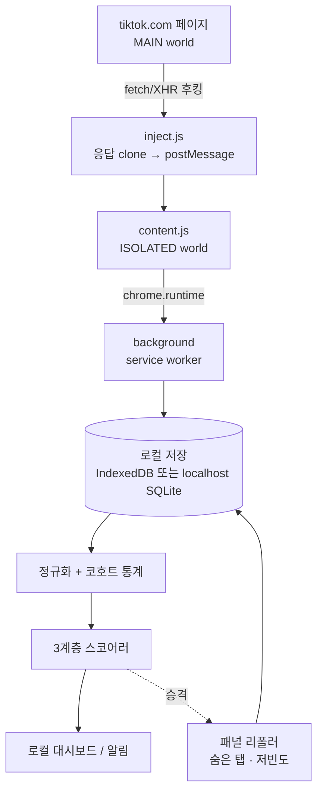

# 모드 C: 내 피드(FYP)에 보이는 컨텐츠를 캡처하는 방식

> [tiktok-like-velocity-design.md](./tiktok-like-velocity-design.md)의 후속. 지표 수식(§6)은 그대로 재사용하고, **수집 아키텍처만 완전히 교체**한다.

---

## 0. 한 줄 결론

**앞 설계에서 가장 어려웠던 "발굴(discovery)" 문제가 통째로 사라진다.** TikTok의 추천 알고리즘이 대신 큐레이션해 주기 때문이다. 대신 **새로운 문제 하나**가 생긴다:

> 같은 영상을 보통 **딱 한 번만** 본다 → 영상별 Δ(증가분)를 만들 수가 없다.

이 문서는 그 문제를 3계층 점수 모델로 푼다.

---

## 1. 이 방식이 명백히 우월한 지점

| | API 폴링 방식 (모드 A/B) | **FYP 캡처 (모드 C)** |
|---|---|---|
| 발굴 | 해시태그 스윕 등 직접 설계 — 가장 어려움 | **알고리즘이 공짜로 해줌** |
| 쿼터 | Research API 1,000 req/day가 천장 | **추가 요청 0건** (이미 받은 응답을 기록) |
| 카운터 정밀도 | 소스에 따라 반올림 위험 | **정확한 정수** (`diggCount` 등 원본 JSON) |
| 서명 파라미터 | 독립 스크래퍼의 최대 난관 (`X-Bogus`, `msToken`) | **페이지가 알아서 서명함** — 우회 불필요 |
| 비용 | 서드파티 유료 API 필요 | **0원** |
| 자격 요건 | Research API는 학술기관 심사 | 없음 |

특히 **서명 문제를 페이지 컨텍스트가 대신 풀어준다**는 점이 크다. 독립 스크래퍼가 계속 깨지는 주된 이유가 이건데, 브라우저 안에서 응답만 훔쳐보면 애초에 발생하지 않는다.

---

## 2. 대신 감수해야 할 것

1. **단일 관측** — 대부분의 영상은 한 번 보고 끝. Δ가 없다. (→ §6에서 해결)
2. **표본 편향** — 내 FYP는 무작위 표본이 아니다. (→ §8, 반드시 읽을 것)
3. **워밍업 기간** — 코호트 통계가 쌓이기까지 1~2주 필요. (→ §9)

---

## 3. 캡처 아키텍처

MV3는 `webRequest`로 응답 **본문**을 읽는 기능을 제거했다. `declarativeNetRequest`도 본문에 접근하지 못한다.
남은 유일한 방법은 **`world: "MAIN"` 콘텐츠 스크립트(Chrome 111+)로 페이지 컨텍스트에 주입해 `fetch`/`XHR`을 몽키패치**하는 것이다.



### 3.1 주입 스크립트 (핵심)

```js
// inject.js — manifest: content_scripts[{ world:"MAIN", run_at:"document_start" }]
const HIT = /\/api\/(recommend\/item_list|post\/item_list|item\/detail|search\/general)/;

const send = (url, json) =>
  window.postMessage({ __tt: true, url, json, at: Date.now() }, "*");

const origFetch = window.fetch;
window.fetch = async function (...args) {
  const res = await origFetch.apply(this, args);
  const url = typeof args[0] === "string" ? args[0] : args[0]?.url ?? "";
  if (HIT.test(url)) {
    // clone() 필수 — 원본 스트림을 소비하면 페이지가 깨진다
    res.clone().json().then((j) => send(url, j)).catch(() => {});
  }
  return res;
};

const origOpen = XMLHttpRequest.prototype.open;
XMLHttpRequest.prototype.open = function (m, url, ...rest) {
  if (HIT.test(String(url))) {
    this.addEventListener("load", () => {
      try { send(String(url), JSON.parse(this.responseText)); } catch {}
    });
  }
  return origOpen.call(this, m, url, ...rest);
};
```

주의사항 3가지:
- **`run_at: "document_start"`** — 페이지 스크립트보다 먼저 실행돼야 후킹이 걸린다.
- **`res.clone()`** — 원본 body를 읽으면 페이지 렌더링이 깨진다.
- 최초 진입 시 데이터는 XHR이 아니라 HTML에 박혀 온다 → `<script id="__UNIVERSAL_DATA_FOR_REHYDRATION__">` 도 파싱해야 첫 화면 분량을 놓치지 않는다.

Firefox는 `world: "MAIN"` 대신 `<script>` 태그 주입 + `wrappedJSObject`로 동일하게 구현 가능. Safari는 제약이 크다.

### 3.2 정규화

```js
function extractItems(json) {
  if (json?.itemList) return json.itemList;                        // recommend / post item_list
  if (json?.itemInfo?.itemStruct) return [json.itemInfo.itemStruct]; // item/detail
  if (Array.isArray(json?.data)) return json.data.map(d => d.item).filter(Boolean); // search
  const scope = json?.__DEFAULT_SCOPE__?.["webapp.video-detail"];  // 하이드레이션 페이로드
  if (scope?.itemInfo?.itemStruct) return [scope.itemInfo.itemStruct];
  return [];
}

const norm = (it) => ({
  video_id:    it.id,
  create_time: it.createTime * 1000,
  creator:     it.author?.uniqueId,
  music_id:    it.music?.id,
  hashtags:    (it.textExtra ?? []).map(t => t.hashtagName).filter(Boolean),
  like:    Number(it.statsV2?.diggCount    ?? it.stats?.diggCount    ?? 0),
  view:    Number(it.statsV2?.playCount    ?? it.stats?.playCount    ?? 0),
  comment: Number(it.statsV2?.commentCount ?? it.stats?.commentCount ?? 0),
  share:   Number(it.statsV2?.shareCount   ?? it.stats?.shareCount   ?? 0),
  collect: Number(it.statsV2?.collectCount ?? it.stats?.collectCount ?? 0),
});
```

> `statsV2`는 값이 **문자열**로 온다 → 반드시 `Number()`. 두 형태가 혼재하므로 fallback 필수.

**설계 원칙: 원본 JSON을 raw로 함께 저장한다.** TikTok은 내부 필드를 예고 없이 바꾼다. raw가 있으면 파서가 깨져도 나중에 재파싱으로 복구되지만, 없으면 그 기간 데이터는 영구 손실이다.

---

## 4. 스키마

앞 설계의 `snapshot`을 그대로 쓰되, **"내가 본 순간" 자체가 공짜 스냅샷**이므로 노출 맥락 컬럼을 추가한다.

```sql
CREATE TABLE snapshot (
  video_id      TEXT        NOT NULL,
  captured_at   TIMESTAMPTZ NOT NULL,
  like_count    BIGINT NOT NULL,
  view_count    BIGINT, comment_count BIGINT, share_count BIGINT, collect_count BIGINT,
  source        TEXT NOT NULL,   -- impression | repoll
  surface       TEXT,            -- fyp | following | hashtag | profile | search | detail
  position      INT,             -- 피드 내 순번 (앞쪽일수록 알고리즘 신뢰도 높음)
  raw           JSONB,           -- 원본 아이템 (파서 복구용)
  PRIMARY KEY (video_id, captured_at)
);

-- §6.3 Tier 3 전용: 엔티티 노출 집계
CREATE TABLE exposure_daily (
  entity_type TEXT NOT NULL,     -- music | hashtag | creator
  entity_id   TEXT NOT NULL,
  day         DATE NOT NULL,
  impressions INT  NOT NULL,
  PRIMARY KEY (entity_type, entity_id, day)
);
```

`video`, `video_score` 테이블은 앞 설계와 동일.

---

## 5. 무엇이 잡히는가

`/api/recommend/item_list/` 응답 1건에 보통 **영상 5~10개**가 실려 온다. 스크롤 한 번에 여러 건. 각 아이템에 위 §3.2의 필드가 전부 들어 있다 — **`createTime`이 있으므로 나이를 정확히 알 수 있고**, 이것이 §6 전체를 가능하게 하는 전제다.

---

## 6. 3계층 점수 모델

단일 관측 문제를 정면으로 푸는 부분.

### Tier 1 — 단일 관측 (전체의 ~90%)

한 번밖에 못 봤어도 `(likes, age)` 두 값은 확실하다. 여기서 **평균 속도**를 얻는다:

```
v̄ = likes / age_hours        [likes/hour]
```

이건 순간 속도가 아니라 생애 평균이다. 하지만 **어린 영상에서는 평균 ≈ 현재**다 — 3시간짜리 영상의 평균 속도가 높으면 그건 지금 오르고 있다는 뜻일 수밖에 없다.

따라서 **Tier 1 알림은 `age ≤ 12h`로 제한**하고, 코호트 z-score로 줄세운다:

```
z = (log1p(v̄) − μ_b) / σ_b        b = 나이 버킷, μ/σ 는 내 피드 코퍼스에서 median/MAD
```

게이트: `age ≤ 12h`, `likes ≥ 300`, `z ≥ 2.0`

> 코호트 통계를 **내 피드 데이터로** 계산한다는 점이 중요하다. 자기 교정(self-calibrating)이 된다 — 내가 보는 컨텐츠 종류의 정상 범위가 자동으로 기준선이 된다.

### Tier 2 — 중복 관측 = 공짜 진짜 스냅샷

같은 영상을 두 번 이상 보는 일이 생각보다 자주 있다:
- FYP가 같은 영상을 재노출
- 해시태그 페이지 / 검색 / 프로필에서 재발견
- 그 영상을 다시 눌러서 상세 진입

**30분 이상 간격의 중복 관측이 2건 있으면 진짜 Δ가 나온다.** 그 순간부터 앞 설계 §6.2의 `burst = v_fast / v_slow`를 그대로 적용한다. 스키마를 스냅샷 기반으로 잡아 두면 이건 공짜로 따라온다.

### Tier 3 — 노출 빈도 자체가 신호 ★ (이 방식만의 고유 지표)

**가장 가치 있는 부분이다.** 알고리즘이 같은 사운드/해시태그를 반복해서 밀어준다면, 그 배포량 증가는 **참여 지표보다 먼저 움직인다.**

엔티티 `e ∈ {music_id, hashtag, creator}` 에 대해:

```
n_e(d)     = 하루 d에 내 피드에서 e가 노출된 횟수
share_e(d) = n_e(d) / N(d)                    ← 그날 총 노출로 정규화 (필수)
burst_e    = EWMA(share_e, 반감기 2d) / EWMA(share_e, 반감기 14d)
```

`share`로 정규화하는 이유: 많이 스크롤한 날은 모든 카운트가 같이 오른다. 정규화 없이는 "많이 본 날"과 "트렌드"를 구분하지 못한다.

`burst_e ≥ 3` = 그 사운드/해시태그가 확산 국면. **좋아요 급상승보다 선행하는 신호**이므로, 리드타임 측면에서 Tier 1/2보다 유용할 수 있다.

보너스: Tier 3은 코호트 통계가 필요 없어서 **1주일이면 신호가 나온다** (Tier 1은 2주 필요).

---

## 7. 패널 승격과 리폴링 예산

Tier 1에서 `z ≥ 2.0`으로 걸린 것만 **추적 패널**에 편입해 재폴링한다. 상위 5~10%에만 예산을 쓰는 구조다.

| 나이 | 재폴링 주기 | 패널 규모 | 일일 요청 |
|---|---|---|---|
| < 6h | 30분 | 20 | 960 |
| 6–24h | 60분 | 25 | 600 |
| 1–3d | 3시간 | 15 | 120 |
| | | **60** | **≈ 1,680/day (1.2 req/min)** |

공격적이라고 느껴지면 **패널 30개 / 최소 간격 60분 → ~400 req/day**부터 시작할 것. 6~48시간 구간의 속도 측정에는 30~60분 샘플링이면 충분하다.

### 리폴링은 반드시 로그인된 브라우저 컨텍스트 안에서

서버에서 영상 HTML을 직접 요청하면 **봇 스코어링에 걸려 하이드레이션 페이로드가 통째로 비어서 오는 경우**가 있다 — 카운터 없는 껍데기 HTML만 받는다. 확장 프로그램이 숨은 탭 / offscreen document로 처리하면 정상 세션 트래픽이라 이 문제를 피한다.

**이것이 독립 스크래퍼 대신 확장 프로그램을 택해야 하는 두 번째 강한 이유다** (첫 번째는 §1의 서명 파라미터).

---

## 8. 편향 — 이걸 모르고 쓰면 결론이 틀린다

### 8.1 생존 편향 (가장 중요)

**FYP는 이미 잘 되고 있는 것만 보여준다.** 즉 코호트 기준선 자체가 "이미 성공한 컨텐츠" 집단이다.

> `z = 2.5`는 "전체 TikTok 대비 상위 0.6%"가 **아니다**. "잘 나가는 것들 중에서도 잘 나감"이다.

절대 해석을 하면 안 되고, **상대 랭킹으로만** 써야 한다. 앞 설계(해시태그 스윕)의 z와 숫자를 직접 비교하는 것도 무의미하다.

### 8.2 개인화 편향

내 FYP는 내 관심사를 반영한다. 얻는 것은 **"전역 트렌드"가 아니라 "내 니치의 트렌드"**다.
목적에 따라 이건 오히려 **장점**이다 — 내 채널 주제와 무관한 글로벌 밈은 애초에 노이즈니까.
전역 트렌드가 필요하면 별도 계정(관심사 중립)을 파거나, 앞 설계의 해시태그 스윕을 병행해야 한다.

### 8.3 관측 시각 편향

밤에만 브라우징하면 그 시간대에 노출되는 영상만 잡힌다 → 나이 분포가 왜곡되고 코호트 통계가 교란된다.
완화: 코호트 버킷에 **요일/시간대**를 교차 변수로 넣거나, 최소 2주 누적으로 평탄화.

### 8.4 노출 순번 편향

피드 앞쪽 = 알고리즘 신뢰도 높음. `position`을 저장해 두고 나중에 feature로 쓰거나, 최소한 코호트를 `position` 구간별로 나눌 것.

---

## 9. 데이터 볼륨 현실

| 사용 패턴 | 일일 노출 수 |
|---|---|
| 캐주얼 (하루 30분) | 200~400 |
| 헤비 (하루 2시간+) | 1,000~2,000 |

코호트 통계는 **나이 버킷당 100개 이상** 샘플이 필요하다. 버킷이 7개면 700개 → 캐주얼 사용자 기준 **누적 1~2주**.

> ⚠️ **첫 2주는 학습 기간이다.** 이 기간에 Tier 1 알림을 켜면 σ가 불안정해서 오탐이 쏟아진다.
> 대신 §6.3 Tier 3(노출 빈도)은 1주면 동작하므로, 워밍업 중에는 이걸 먼저 켠다.

---

## 10. 리스크 등급 — 이 순서대로 올라갈 것

| 방식 | TikTok에 발생시키는 추가 트래픽 | 리스크 | 권장 |
|---|---|---|---|
| **수동 브라우징 + 수동 캡처** | **0건** — 이미 내 브라우저가 받은 데이터를 기록만 함 | 최저 | ✅ **여기서 시작** |
| 백그라운드 리폴링 (패널 30~60개, ≥30분) | ~400–1,700 req/day | 중 | ⚠️ 조심스럽게, 지터 넣고 |
| 자동 스크롤 봇 (Playwright 등) | 인위적 조회/참여 발생 | **높음 — 계정 제재 가능** | ❌ 비권장 |

가장 낮은 단계는 **내가 이미 받은 데이터를 내 컴퓨터에 기록하는 것**이라 성격이 다르다. 자동 스크롤은 조회수를 인위적으로 발생시키므로 질적으로 다른 문제다.

**개인정보·보안:** 데이터는 전부 로컬에 둔다(IndexedDB 또는 localhost SQLite). 세션 쿠키는 어떤 경우에도 외부로 나가면 안 된다. 확장 프로그램 권한은 `host_permissions: ["*://*.tiktok.com/*"]` 로 최소화한다.

---

## 11. 로드맵

| Phase | 내용 | 예상 | 산출물 |
|---|---|---|---|
| 1 | MV3 확장 뼈대 + MAIN world 후킹 + raw JSON을 IndexedDB에 적재 | 1일 | **"내가 본 모든 영상" 로그**가 이 시점부터 쌓임 |
| 2 | 정규화 + 로컬 대시보드 (Tier 1 `v̄` 랭킹, 정렬/필터) | 1일 | 눈으로 확인 가능한 최소 제품 |
| 3 | Tier 3 노출 빈도 지표 (사운드/해시태그 burst) | 1일 | **1주 후부터 신호 나옴** |
| 4 | 코호트 통계 누적 → Tier 1 z-score 알림 | 2주 대기 후 0.5일 | |
| 5 | 패널 승격 + 리폴링 → Tier 2 burst | 2일 | |

**Phase 1을 최우선으로 할 것.** 데이터는 소급 수집이 불가능하다 — 오늘 안 쌓으면 오늘 데이터는 영원히 없다. 파서가 미완성이어도 raw JSON부터 쌓기 시작하는 게 맞다.

---

## 12. 앞 설계와의 관계

**배타적이지 않다. 하이브리드가 최적이다.**

```
FYP 캡처  →  무료 시더 + Tier 3 선행 신호
                    ↓ (z ≥ 2.0 승격)
패널 폴러  →  정확한 속도 측정 (앞 설계 §6.2 burst, §6.4 lift 그대로)
```

FYP가 발굴을 공짜로 해결하고, 앞 설계의 폴링 엔진이 속도 측정을 담당한다. 앞 설계에서 병목이던 Research API 쿼터는 발굴에 안 써도 되므로 전량 패널 갱신에 투입할 수 있다.

---

## 참고

- [MV3에서 응답 본문 가로채기 — MAIN world 주입](https://dev.to/wilow445/how-to-intercept-server-sent-events-in-chrome-extensions-mv3-guide-23kb)
- [chrome-slurp-xhr — fetch/XHR 응답 캡처 구현 예시](https://github.com/byronwall/chrome-slurp-xhr)
- [TikTok 하이드레이션 페이로드 구조 분석](https://scrapfly.io/blog/posts/guide-to-tiktok-api)
- [TikTok 웹 데이터 구조 가이드](https://hasdata.com/blog/tiktok-scraping-python)

> 내부 엔드포인트와 JSON 필드는 공식 API가 아니며 **예고 없이 변경된다.** §3.2의 raw 저장 원칙을 반드시 지킬 것.
