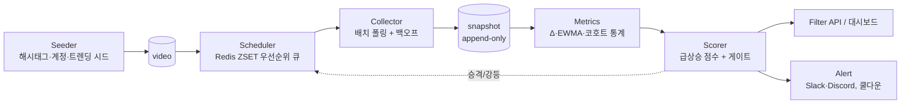

# TikTok 좋아요 급상승(Like Velocity) 탐지 시스템 설계

> 목표: 특정 유저 또는 전체 컨텐츠를 대상으로, **최근 업로드된 게시물 중 좋아요 수가 급상승 중인 것**을 필터링/발굴한다.

---

## 0. 결론 먼저

**설계 가능하다.** 다만 핵심 제약이 하나 있다.

> TikTok의 어떤 API도 "좋아요 증가율"이나 시계열을 주지 않는다. 전부 **호출 시점의 절대 카운터(point-in-time snapshot)** 만 반환한다.

따라서 "급상승"은 조회하는 것이 아니라 **직접 만들어야 하는 파생 지표**다. 시스템의 본질은:

```
주기적 폴링 → 스냅샷 append-only 적재 → Δ(delta) 계산 → 정규화·점수화 → 필터/알림
```

이 문서는 그 파이프라인의 데이터 소스 선택, 폴링 예산, 지표 수식, 스키마, 검증 방법을 정의한다.

---

## 1. 세 가지 수집 모드는 난이도가 완전히 다르다

| | 모드 A: 특정 유저 | 모드 B: 전체 컨텐츠 | [모드 C: 내 피드 캡처](./tiktok-fyp-capture-design.md) |
|---|---|---|---|
| 대상 집합 | 명확 (추적 계정 목록) | 불명확 — **먼저 정의해야 함** | 알고리즘이 결정 |
| 발굴(discovery) | 불필요 | 필수 (가장 어려운 부분) | **공짜 — FYP가 대신함** |
| 폴링 비용 | 계정 수에 비례 | 탐색 범위에 비례 (폭발적) | **추가 요청 0건** |
| 공식 API로 가능? | ✅ 현실적 | ⚠️ 쿼터상 부분적 | ❌ 비공식 (브라우저 확장) |
| 기준선(baseline) | 그 계정의 과거 영상 | 같은 나이대 코호트 | 내 피드 코호트 (자기 교정) |
| 약점 | — | 쿼터 천장 | **단일 관측 · 생존 편향** |

**모드 B의 함정:** TikTok에는 "전체 신규 영상 스트림" API가 없다. 즉 "전체 컨텐츠"란 실제로는 **내가 정의한 유니버스**다:

```
유니버스 = (추적 크리에이터의 신규 영상)
         ∪ (해시태그/키워드 스윕 결과)
         ∪ (Creative Center 트렌딩 시드)
         ∪ (이전에 한 번 뜬 적 있는 영상)
```

이 유니버스 정의가 곧 커버리지의 상한이다. 여기 없으면 절대 못 잡는다.

> **모드 C가 이 문제를 우회한다.** 내 FYP에 뜨는 것을 그대로 캡처하면 TikTok의 추천 알고리즘이 유니버스를 대신 정의해 준다. 대신 표본 편향을 감수해야 한다 — [tiktok-fyp-capture-design.md](./tiktok-fyp-capture-design.md) 참고. 안드로이드/갤럭시 구현은 [tiktok-android-capture-design.md](./tiktok-android-capture-design.md).

---

## 2. 데이터 소스 비교

| 소스 | 커버리지 | 카운터 정밀도 | 비용/쿼터 | 정책 | 적합 모드 |
|---|---|---|---|---|---|
| **Display API** `POST /v2/video/list/` (scope: `user.info.basic,video.list`) | 인증한 **본인 계정만** | 정확한 정수 | 무료 | ✅ 완전 공식 | A (자사/고객사 계정) |
| **Research API** `POST /v2/research/video/query/` | 공개 영상 전반. `create_date`·`username`·`hashtag_name`·`keyword`·`region_code` 필터, boolean(AND/OR/NOT) 조합 | 정확한 정수 | 무료. **1,000 req/day · 100,000 records/day**, 1콜당 최대 100건, 00:00 UTC 리셋 | ✅ 공식이나 **비영리 학술기관 소속 + 지역 제한 + 수동 심사** | A + B |
| **Business / Creator Marketplace API** | 광고주·계약 크리에이터 | 정확 | 계약 기반 | ✅ | A |
| **서드파티 API** (EnsembleData, Apify, TikAPI, Bright Data 등) | 사실상 공개 전체 | 정확한 정수 제공(축약값 아님) | 유료, 건당 과금 | ⚠️ TikTok ToS 회색지대 | A + B |
| **내 피드 캡처** (브라우저 확장, [모드 C](./tiktok-fyp-capture-design.md)) | 내 FYP에 노출된 것 (알고리즘 큐레이션) | 정확한 정수 (원본 JSON) | **0원, 추가 요청 0건** | ⚠️ 비공식 엔드포인트. 수동 캡처는 추가 트래픽 없음 | B (+A 보조) |
| **직접 웹 스크래핑** | 전체 | ⚠️ `1.2K` 형태 **반올림 위험** | 프록시·차단 대응 인프라 | ❌ ToS 위반 소지 | 비권장 |

### 소스 선택 가이드
- **내 계정 / 고객사 계정만** → Display API. 무료, 안전, 끝.
- **경쟁사·특정 크리에이터 20~50개 추적** → Research API (자격 있으면) 또는 서드파티.
- **전체 트렌드 발굴, 상업적 규모** → 서드파티 유료 API가 현실적. 단 법률 검토 필수.

### 반올림 문제 (스크래핑 소스일 때 치명적)
표시값이 `12.3K`면 실제값은 12,250~12,349 → **오차 ±50**. 15분 간격 폴링으로 잡히는 증가분이 30이면 신호가 오차에 묻힌다.
→ 최소 감지 delta `≥ 표시단위 × 2` 를 만족하도록 폴링 간격을 늘리거나, 정확한 정수를 주는 소스를 쓸 것.

---

## 3. 아키텍처



핵심 원칙 3가지:
1. `snapshot`은 **절대 UPDATE하지 않는다** (append-only). 모든 지표는 재계산 가능해야 백테스트가 된다.
2. 폴링 주기는 **동적**이다. 뜨거운 영상에 예산을 몰아준다.
3. 점수 계산은 수집과 분리한다. 가중치를 바꿔도 재수집이 필요 없어야 한다.

---

## 4. 스키마 (PostgreSQL + TimescaleDB 기준)

```sql
CREATE TABLE creator (
  creator_id    TEXT PRIMARY KEY,
  username      TEXT UNIQUE NOT NULL,
  tracked       BOOLEAN     NOT NULL DEFAULT TRUE,
  baseline_json JSONB                                -- 나이별 좋아요 중앙값 곡선 캐시
);

CREATE TABLE video (
  video_id      TEXT PRIMARY KEY,
  creator_id    TEXT REFERENCES creator(creator_id),
  create_time   TIMESTAMPTZ NOT NULL,                -- 업로드 시각 (UTC)
  first_seen_at TIMESTAMPTZ NOT NULL,
  hashtags      TEXT[],
  region_code   TEXT,
  status        TEXT NOT NULL DEFAULT 'active',      -- active | deleted | private
  poll_tier     SMALLINT NOT NULL DEFAULT 0,
  next_poll_at  TIMESTAMPTZ NOT NULL
);
CREATE INDEX ON video (next_poll_at) WHERE status = 'active';
CREATE INDEX ON video (create_time DESC);

-- append-only. 절대 UPDATE 금지.
CREATE TABLE snapshot (
  video_id      TEXT        NOT NULL,
  captured_at   TIMESTAMPTZ NOT NULL,
  like_count    BIGINT      NOT NULL,
  view_count    BIGINT,
  comment_count BIGINT,
  share_count   BIGINT,
  source        TEXT        NOT NULL,                -- research | display | vendor:xxx
  PRIMARY KEY (video_id, captured_at)
);
SELECT create_hypertable('snapshot', 'captured_at');

-- 스코어러가 갱신하는 현재 상태 (스냅샷과 분리)
CREATE TABLE video_score (
  video_id     TEXT PRIMARY KEY REFERENCES video(video_id),
  computed_at  TIMESTAMPTZ NOT NULL,
  like_count   BIGINT,
  v_fast       DOUBLE PRECISION,   -- 최근 좋아요/시간 (EWMA, 반감기 1h)
  v_slow       DOUBLE PRECISION,   -- 기준 좋아요/시간 (EWMA, 반감기 8h)
  burst        DOUBLE PRECISION,   -- v_fast / v_slow
  z_cohort     DOUBLE PRECISION,   -- 같은 나이대 대비 z-score
  lift         DOUBLE PRECISION,   -- 이 크리에이터 평소 대비 배수
  score        DOUBLE PRECISION,
  flags        TEXT[]              -- negative_delta | low_view_growth | cold_start | rounded_source
);
CREATE INDEX ON video_score (score DESC);
```

---

## 5. 폴링 전략 — 비용을 결정하는 부분

### 5.1 핵심 최적화: "영상 단위"가 아니라 "쿼리 단위"로 폴링한다

Research API `video/query`는 **1콜당 최대 100건**을 반환한다. `username` 필터로 부르면 그 계정의 최근 영상 카운터가 **한 번에 전부** 갱신된다.

> ⇒ 비용은 *추적 영상 수*가 아니라 **추적 계정 수 × 폴링 빈도**에 비례한다.
> ⇒ 모드 B에서는 해시태그 쿼리 1콜이 **발굴 + 갱신을 동시에** 수행한다.

이 사실을 놓치면 비용이 100배 차이난다.

### 5.2 나이 기반 티어

| 영상 나이 | 폴링 주기 | 근거 |
|---|---|---|
| 0–6h | 15분 | 확산 여부가 결정되는 구간. 정보량 최대 |
| 6–24h | 30분 | |
| 1–3d | 2시간 | |
| 3–7d | 6시간 | |
| > 7d | 24시간 또는 추적 종료 | `score` 상위면 티어 승격 |

동적 조정: 직전 사이클에서 `burst ≥ 2` 면 티어 한 단계 승격, 3사이클 연속 `v_fast < v_min` 이면 강등.

### 5.3 스케줄러 구현
```
ZADD  poll_queue  <next_poll_at_epoch>  <creator_id 또는 query_key>
워커:  ZRANGEBYSCORE poll_queue 0 <now> LIMIT 0 50  →  배치 폴링  →  ZADD 재등록
```
Redis ZSET 하나면 충분하다. 소규모면 `next_poll_at` 인덱스 + cron으로도 동일하게 된다.

### 5.4 쿼터 예산 (Research API 1,000 req/day 기준)

계정당 하루 폴링 가능 횟수 = `1000 / 추적계정수`

| 추적 계정 | 하루 폴링 | 실효 간격 | 급상승 감지 |
|---|---|---|---|
| 20개 | 50회 | ~29분 | ✅ 충분 |
| 50개 | 20회 | ~72분 | ⚠️ 아슬아슬 |
| 100개 | 10회 | ~2.4시간 | ❌ 6시간 리드타임 확보 불가 |
| 500개 | 2회 | 12시간 | ❌ |

**결론:** 공식 Research API 단독으로는 **20~40계정 규모의 모드 A**가 현실적 상한이다.
모드 B(전체 탐색)는 발굴에도 콜을 나눠 써야 하므로 더 빡빡하다 — 예: 700콜 갱신 + 300콜 해시태그 스윕.
그 이상 규모가 필요하면 **서드파티 유료 API 병행이 사실상 필수**다.

---

## 6. 지표 정의 — 설계의 핵심

기호: 영상 `i`, 시각 `t`, 좋아요 `L(t)`, 조회수 `V(t)`, 나이 `a = t − create_time`

### 6.1 정규화된 속도 (반드시 시간당 비율로)

스냅샷 간격이 불규칙(장애·백오프·티어 변경)하므로 **스냅샷 간 단순 차이를 쓰면 안 된다.**

```
v = (L(t₂) − L(t₁)) / ((t₂ − t₁) 시간)          [likes/hour]
```

음수 delta(스팸 좋아요 정리 등)는 `0`으로 클램프하고 `negative_delta` 플래그를 남긴다.

### 6.2 이중 EWMA → burst ratio ★

```
τ = half_life / ln2
α = 1 − exp(−Δt / τ)                    ← 불규칙 간격을 흡수하는 핵심
v_fast ← α_fast·v + (1−α_fast)·v_fast    (half_life = 1h)   "지금 얼마나 빠른가"
v_slow ← α_slow·v + (1−α_slow)·v_slow    (half_life = 8h)   "이 영상의 평소 속도"

burst = (v_fast + ε) / (v_slow + ε)
```

`burst ≥ 2.0` = **자기 자신 대비 2배로 가속 중** → 급상승의 1차 신호.
이 지표의 장점: 영상 크기와 무관하다. 1만짜리든 100만짜리든 동일 기준으로 비교된다.

### 6.3 나이 코호트 z-score (모드 B용)

어린 영상은 원래 빠르다. 나이를 무시하고 속도로 줄세우면 신규 영상만 상위를 차지한다.

나이 버킷 `b(a) ∈ {0-1h, 1-3h, 3-6h, 6-12h, 12-24h, 1-2d, 2-7d}` 별로 최근 7일 코호트에서 robust 통계를 구한다:

```
μ_b = median( log1p(v_fast) )
σ_b = 1.4826 × MAD( log1p(v_fast) )       ← 이상치에 강건
z_cohort = (log1p(v_fast) − μ_b) / σ_b
```

`z_cohort ≥ 2.5` = 같은 나이대 상위 ~0.6%.

### 6.4 크리에이터 기준선 lift (모드 A용) ★

"이 계정에서 유난히 잘 나가는 영상"의 정의. 그 계정 **과거 N개(권장 30개) 영상의 같은 나이 시점** 좋아요 중앙값과 비교한다:

```
M_c(a) = median_{j ∈ 최근 30개 영상} L_j(a)
lift   = L_i(a) / M_c(a)
```

과거 영상의 `a` 시점 값은 스냅샷을 **로그 선형 보간**해서 얻는다. 스냅샷이 없는 구간이면
`L_j(a) ≈ L_j(현재) × (a / a_현재)^γ`, `γ ≈ 0.5` 로 근사하고 신뢰도 낮음으로 표시.

`lift ≥ 3.0` = 평소의 3배 → 알림 대상. 이 지표 하나만으로도 모드 A는 실용적으로 동작한다.

### 6.5 품질 게이트 — 오탐 제거 (없으면 시스템이 쓰레기가 된다)

| 게이트 | 기준(예시) | 이유 |
|---|---|---|
| 절대량 하한 | `L ≥ 300` AND `v_fast ≥ 50/h` | 5→15는 300% 상승이지만 무의미 |
| 조회수 동반 확인 | `ΔV / Δt` 도 함께 상승 | 진짜 알고리즘 푸시는 **조회수가 먼저** 튄다. 조회수 정체 + 좋아요 폭증 = 인위적 유입 의심 |
| 참여율 이상치 | `er = ΔL/ΔV` 가 코호트 대비 극단 | 봇 탐지 |
| **2연속 확인** | 연속 2개 스냅샷에서 임계 초과 시에만 알림 | 단일 스냅샷 스파이크 = 대부분 측정 오차 |
| 측정 하한 | 반올림 소스면 `ΔL ≥ 표시단위×2` | 3장 반올림 문제 |
| 쿨다운 | `video_id`당 6시간 | 알림 스팸 방지 |

### 6.6 최종 점수

```
score = 1.0·log(burst) + 1.0·z_cohort + 0.3·log1p(v_fast) + 0.8·log(lift)
        단, 6.5의 게이트를 모두 통과한 영상만
```

가중치 `(1.0, 1.0, 0.3, 0.8)`는 **초기값일 뿐**이다. 8장 백테스트로 반드시 튜닝한다.
`log1p(v_fast)` 항은 "비율은 크지만 절대량이 작은" 영상을 적당히 눌러주는 역할.

### 6.7 참조 구현 (불규칙 간격 EWMA)

```python
import math

HL_FAST, HL_SLOW = 1.0, 8.0          # hours
EPS = 1e-6

def update(state, prev_like, prev_at, like, at):
    dt = (at - prev_at).total_seconds() / 3600.0
    if dt <= 0:
        return state
    v = max(0.0, (like - prev_like)) / dt            # 음수 클램프
    for key, hl in (("v_fast", HL_FAST), ("v_slow", HL_SLOW)):
        tau = hl / math.log(2)
        alpha = 1.0 - math.exp(-dt / tau)            # 간격 보정
        state[key] = alpha * v + (1 - alpha) * state.get(key, v)
    state["burst"] = (state["v_fast"] + EPS) / (state["v_slow"] + EPS)
    return state
```

---

## 7. 필터 쿼리

```sql
-- 최근 48시간 업로드 중 급상승 상위 50
SELECT v.video_id, c.username, v.create_time,
       s.like_count, round(s.v_fast) AS likes_per_hour,
       round(s.burst::numeric, 2) AS burst,
       round(s.lift::numeric, 2)  AS lift,
       round(s.score::numeric, 3) AS score
FROM video_score s
JOIN video   v USING (video_id)
JOIN creator c USING (creator_id)
WHERE v.status = 'active'
  AND v.create_time > now() - interval '48 hours'
  AND s.like_count >= 300
  AND s.v_fast     >= 50
  AND (s.burst >= 2.0 OR s.z_cohort >= 2.5 OR s.lift >= 3.0)
  AND NOT ('low_view_growth' = ANY(s.flags))
ORDER BY s.score DESC
LIMIT 50;
```

특정 유저만 보려면 `AND c.username = $1`, 해시태그 기준이면 `AND v.hashtags && $1::text[]`.

---

## 8. 엣지 케이스

| 상황 | 처리 |
|---|---|
| 첫 스냅샷 (delta 없음) | `v₀ = L / age_hours` 로 부트스트랩. `cold_start` 플래그, 점수에 0.5배 감쇠 |
| 스냅샷 누락 (수집기 장애) | EWMA는 `Δt` 보정으로 자동 흡수됨. 단 gap > 티어주기×3 이면 `v_slow` 재초기화 |
| 카운터 감소 | 0으로 클램프 + `negative_delta` 플래그. 반복되면 추적 중단 |
| 영상 삭제/비공개 | 404 또는 응답 누락 → `status` 전환, 큐에서 제거. 스냅샷은 보존 여부를 정책으로 결정 |
| `create_time` 미제공 소스 | `first_seen_at` 대체, 나이 신뢰도 낮음 표시 (코호트 z 계산에서 제외) |
| 시간대 | **전부 UTC 저장**, 표시만 KST 변환 |
| 레이트리밋 429 | 지수 백오프 + jitter, 티어 일시 강등 |

---

## 9. 검증 — "된다"고 말할 수 있는 근거

2주 수집 후 백테스트한다. 이 단계 없이 임계값을 정하는 건 추측이다.

- **라벨**: 업로드 7일 시점 좋아요가 해당 코호트/계정 중앙값의 **10배 이상** = `viral`
- **평가 시점**: 업로드 후 6시간
- **지표**:
  - `Precision@20`, `Recall@100`
  - **Lead time** = (내 알림 시각) − (실제 폭발 변곡점) 의 중앙값 — 실무에서 가장 중요
- **베이스라인 비교**: (a) 단순 `likes / age` 랭킹, (b) 절대 Δ좋아요 랭킹
- **합격선 제안**: 6시간 시점 `Precision@20 ≥ 0.4`, lead time 중앙값 `≥ 6h`

가중치 `w`와 임계값은 이 백테스트에서 grid search로 결정한다.

---

## 10. 스택 제안

| 계층 | 소규모 (계정 ~20) | 확장 시 |
|---|---|---|
| 수집 | Python + `httpx` + `tenacity` | 동일, 워커 N개 |
| 스케줄 | cron + `next_poll_at` 인덱스 | Redis ZSET 우선순위 큐 |
| 저장 | SQLite / Postgres | Postgres + TimescaleDB (continuous aggregate 시간당 롤업) |
| 점수 | 배치 SQL + Python | 증분 계산 워커 |
| 알림 | Slack Incoming Webhook | + 대시보드(Grafana / 자체 UI) |
| 배포 | 단일 컨테이너 | 수집/스코어러 분리 |

**시작은 SQLite + cron으로 충분하다.** 20계정 30분 폴링이면 하루 스냅샷 수천 건 수준이다.

---

## 11. 로드맵

| Phase | 내용 | 예상 |
|---|---|---|
| 0 | 데이터 소스 확정, 토큰/계약 확보 | 0.5일 |
| 1 | 수집기 + `snapshot` 적재, 계정 20개, 30분 크론 | 2일 |
| 2 | `v_fast`/`v_slow`/`burst` + Slack 알림 (동작하는 최소 제품) | 1일 |
| 3 | 코호트 z-score, 크리에이터 lift, 품질 게이트 | 2일 |
| 4 | 백테스트 + 가중치/임계값 튜닝 | 2일 |
| 5 | 모드 B 확장 (해시태그 스윕, 트렌딩 시드) | 3일+ |

Phase 2까지면 이미 실용적으로 쓸 수 있다.

---

## 12. 정책·법적 유의사항

- **공식 API 우선.** Research API는 비영리 학술기관 소속 + 지역 제한 + 수동 심사가 필요하다 — 상업적 용도로는 자격이 안 나올 가능성이 높다.
- **서드파티/스크래핑은 TikTok 서비스 약관 위반 소지**가 있다. 상업적 사용 전 법률 검토를 권한다.
- **개인정보**: 공개 집계 지표만 저장하고 사용자 식별정보는 최소화한다. 삭제·비공개 전환된 영상은 수집 데이터도 연동 삭제하는 정책을 둔다.
- 수집 주체·목적·보관기간을 문서화해 둘 것.

---

## 참고

- [TikTok Research API — Query Videos](https://developers.tiktok.com/docs/en/research-api-specs-query-videos)
- [TikTok Research API — Getting Started](https://developers.tiktok.com/docs/en/research-api-get-started)
- [TikTok Research API — FAQ (쿼터)](https://developers.tiktok.com/doc/research-api-faq)
- [TikTok Display API — Video List](https://developers.tiktok.com/doc/tiktok-api-v2-video-list)
- [TikTok Display API — Overview](https://developers.tiktok.com/docs/en/display-api-overview)

> 쿼터·필드·자격 요건은 변경될 수 있으므로 구현 착수 전 공식 문서에서 재확인할 것.
